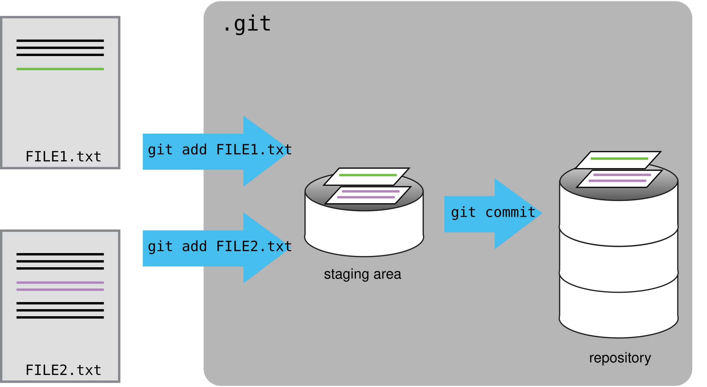

```{r knitr setup, include=FALSE}
# some setup options for outputing markdown files; feel free to ignore these
# These are the default options for this report; more information about options here: https://yihui.name/knitr/options/
knitr::opts_chunk$set(eval = FALSE, # evaluate code chunks
                      include = TRUE, # include the console output of the code in the final document
                      echo = TRUE, # include the code that generated the report in the final report
                      warning = FALSE, # include warnings
                      message = FALSE, # include console messages
                      collapse = TRUE, # Merge code blocks and output blocks, if possible.
                      dpi = 300, # the default figure resolution
                      fig.dim = c(6, 5.5), # the default figure dimensions
                      cache = TRUE) # save the calculations so that kniting is faster each time. (Sometimes this option can cause issues and images won't reflect the most recent code changes, if this happens, just delete the *_cache folder and reknit the code.)
```

# Overview

## Learning Goals for Today

1.  Why use `git` ?
2.  `Git`-ting started in RStudio (~~sorry~~)
3.  The basic git workflow
4.  If time: using 'remotes' (aka github)

# Introduction to `git`

## **Why should we be using version control?**

1.  To keep track of changes
    -   Avoid the `mypaper_final_final_reallydonethistime.docx` problem.
2.  To document reasons for each change.
3.  To preserve multiple versions of documents simultaneously.
4.  To collaborate with others and not create conflicting versions of the same document.
5.  To be valuable to future employers! ;)

## What is `git` doing?

-   Git keeps track of your changes. It monitors changes as if they were separate from the document itself.
-   Each change is a snapshot of the project in it's current state.
    -   you get to choose which files are in the picture
    -   you can compare your picture to collaborators' pictures and choose to accept changes you like.

## Git workflow



## The difference between `git` and GitHub

-   `git` is the name of the software (it's completely free)
-   [GitHub](https://github.com) is a website that is meant as a public place to share code/projects that are tracked by git (it's mostly free but you have to pay for some bits if your projects get large)
-   You can use `git` without ever interfacing with GitHub,
-   But GitHub is a helpful tool when you want to:
    -   publicly share code
    -   collaborate with those who are not on the same intra-net as you are
    -   maintain two synced copies of code in different locations

## Github


## Git

::: {#fig-gitcl layout-ncol="1"}

:::

## Ways to interface with `git`

1.  Use a program with a graphical user interface (GUI) such as GitHub desktop or Rstudio (many other options exist: [Github GUIs](https://git-scm.com/tools/guis))
2.  The command line (instructions you type into your computer)

*Today we won't focus on installing or setting up any of these, but come talk to me if you want help with that*

[HappyGitWithR's Installation instructions](https://happygitwithr.com/install-git)

## Before you begin: set up a repository

***repository**: a storage area (usually a directory) where git can store all the history of a project and information of who changed what and when.*

1.  To start in git, you designate a folder where your all of your project files will be stored.

This folder is called a repository (often shortened to "repo").

In RStudio this can be done when you set up a new project

::: notes
Demonstrate setting up an r project
:::

## Pause to show repository setup


# Working in a repository

## The git workflow

1.  Make changes to file(s)\
2.  "Stage" those changes\
3.  "Commit" the changes


## Pause to show the workflow in Rstudio


## 

### Check on git status

One file - our `test.R` - file is "untracked".

### Stage the file

Our file is now *staged* and ready to be committed.

### Commit the changes

-   We *commit* (take a snapshot of) the changes
-   and give a message explaining what the purpose of the changes was.

## An aside about commit messages

-   like a lab notebook - should be informative\
-   ideally, you should commit often and in small parts. This makes reverting back easier

Bad messages:

``` bash
-m "some updates"
-m "fixes bugs"
-m "adds three new sections"
```

## Tracking changes

-   How can you figure out the differences between two files?

## Tracking changes

First...

### 

Add some code to our test.R file:

```{r}
x <- rnorm(n = 50, mean = 5, sd = 1)
saveRDS(x, "x.RDS")
y <- rnorm(n = 50, mean = 1, sd = 1)
saveRDS(y, "y.RDS")
```

The file is now shown as modified, but not yet staged.

## Tracking changes

### What if we forgot exactly what changed?

``` bash
git diff # shows line-by-line changes
```

## Tracking changes: Looking back in time

-   The log shows a history of the commits you've made. Each is given a unique identifier that you can use to refer to that point in the history.

## Working on branches

-   Branches allow you to create and test updates without affecting the working copy.
-   The default branch is called `main`

## Working on branches

-   You probably want to create a new branch if:
    -   You are working on a series of large changes that constitute one update.
    -   You want multiple working versions of your code (for example, a first and second draft for a paper)
    -   You think you might want to easily refer back to that repository state at some time in the future.
    -   You want to tinker with impunity

## Working on branches

The basic branch workflow:

1.  Create a new branch
2.  Make changes, test, commit those changes.
3.  "Merge" the branch with the original copy of your work (the `main` branch)

## Pause to create a branch

## Ignoring files

Git allows you to ignore files that you don't want tracked. Often these files are very large, temporary, or unnecessary to generate the final product.

Examples of good files to ignore:

-   RStudio files: `.Rproj.user, .Rhistory, *.Rproj, .RData`\
-   `knitr` cache files `*_cache/`\
-   Sensitive data files

To ignore these files use `nano` to create a file called `.gitignore` and add them in a list.

## Ignoring files

Example:

``` bash
[hannah@localhost microbe]$ cat .gitignore 
.Rproj.user
.Rhistory
microbes.Rproj
.RData
```

## Using Github (and other "remotes")

***remote**: a repository that is not on your local computer. Remotes can be on any number of places, including websites like GitHub or Bitbucket, and on remote servers, such as microbe/proteus.*

-   Useful if you want a main copy that everyone draws from and contributes to.

## Topics for another day

Today we won't create a remote for our repository, but I can show how it can be used (if time allows)

## In Summary

-   Git is a powerful tool and we should all be using it for our code!

-   It has a bit of a learning curve, but GUI's exist that make it much, much, easier

-   The best way to learn, is to start tracking changes on your own projects!

-   I'm here and happy to be a resource, for questions you might have

## Resources/Links/Inspiration:

Today's presentation is heavily inspired by:

1.  Sofware Carpentry's lesson in git
    -   <https://swcarpentry.github.io/git-novice/index.html>
2.  Max Joseph's git intro presentation
    -   <https://github.com/mbjoseph/git-intro>
3.  Visual Git Reference
    -   <http://marklodato.github.io/visual-git-guide/index-en.html>
4.  git - the simple guide
    -   <https://rogerdudler.github.io/git-guide/>
5.  Think like (a) Git (good site for advanced beginners - that's you, after today!)
    -   <http://think-like-a-git.net/>

# Topics for another day

## Create and connect to a remote

Now we will all create a remote repository on github for our `microbes` file.

1.  Create the empty repository on github

-   important to prevent merge conflicts!:
    -   do not create a readme
    -   do not create a .gitignore

2.  Let git know that a remote called `origin` exists; and tell it where to find it on the internet

``` bash
git remote add origin https://github.com/hhollandmoritz/microbes.git
```

3.  Add all changes and files that are not in .gitignore to the remote repository.

``` bash
git push -u origin main
```

## Create and connect to a remote

4.  Anytime you make changes, you can now `git push` them to the repository online.

### What are origin and main????

-   "origin" refers to the remote repository; technically you can call it anything, but most git documentation uses this convention so for clarity we will too.
    -   "origin" is confusing because often you are making changes locally and then moving them to the remote repository rather than the other way around - unless you are collaborating.
-   main refers to the branch

### Cardinal Rule: Always `pull` before you `push`

This helps prevent merge conflicts! (It's similar to creating a test_merge branch).

## Connect to an already-existing remote:

<https://github.com/hhollandmoritz/collaboration_practice>

1.  Clone (copy) the repository and all of its history onto your local computer.

``` bash
git clone https://github.com/hhollandmoritz/collaboration_practice.git
```

2.  Make some changes, add, and commit them.
3.  pull any new changes down from the remote repository first. Push your changes up to the repository.

## Working on branches

To create a branch:

``` bash
git branch # check what branch you are currently on
git checkout -b <branchname> # the -b creates the branch; checkout moves you to the branch
git branch # see that you have switched to the new branch.
```

To switch between branches:

``` bash
git branch # check what branch you are currently on
git checkout <branchname> # checkout moves you to the branch
git branch # see that you have switched to the new branch.
```

## Working on branches

### Your turn!

1.  Create a new branch called `development`, and switch into it.

2.  While on `development` make a new file called `notes.txt`; Write a note to yourself inside the file using `nano`.

3.  Add and commit the changes. Check your `git status`

4.  Type `ls`

5.  Now changes branches back to main, and type `ls` again. What do you notice?

## Working on branches: Merging

Many people dread merging because it often leads to conflicts. Conflicts happen when `git` can't figure out on it's own how to merge two files.

-   Merge conflicts usually happen because:
-   Two or more people make different changes to the same line of the same file.
-   One person deletes a file, and another person makes changes to the same file.

Luckily branches provide a great solution for this! You can test out a merge before it happens and if all goes well, you can run the merge for real.

## Working on branches: Merging

### The Scout Pattern - this method attributable to think-like-a-git.net

1.  Move to the main branch (or whatever branch you want to merge with)

``` bash
git checkout main
```

2.  Create a new branch to test the merge and switch to it.

``` bash
git checkout -b test_merge
```

## Working on branches: Merging

### The Scout Pattern - Continued

3.  merge your development branch into test_merge

``` bash
git merge development
```

a.  If there is a conflict, you can try to resolve it by editing the files by hand, or abort the merge with the command

``` bash
git reset --hard
```

b.  If there is no conflict, the merge will happen automatically.

## Working on branches: Merging

### The Scout Pattern - Continued

4.  If you are happy with your merge, you can now merge test_merge into main.

``` bash
git checkout main
git merge test_merge
```

If you are unhappy with the merge, move back to main and delete the test_merge branch.

``` bash
git checkout main
git branch -D test_merge
```

## Working on branches: Merging

### The Scout Pattern - Your turn!

Use the Scout pattern to merge changes from development into the main branch.

1.  Move to the main branch and verify that everything is up to date.

2.  Create and move into a new branch called test_merge. Hint: `git checkout -b <branch name>` creates a branch

3.  Merge development into `test_merge`.

4.  Move back to the `main` branch and merge the `test_merge` branch into it.

## Collaborating

<https://github.com/hhollandmoritz/collaboration_practice>

### Your turn!

1.  Clone the `collaboration_practice` repository.
2.  Use nano to create a text file with your name, and write your favorite food in the text file.

``` bash
nano hannah.txt
cat hannah.txt
>chocolate
```

2.  Add and commit your file.
3.  Pull any changes from the remote repository first.
4.  Push your changes to the repository.

## Collaborating: Branches

One great way to collaborate, is to create branches with your changes. This helps avoid conflicts.

The workflow:

1.  Create a new branch to hold your chages and switch to it.

``` bash
git checkout -b harry_potter
```

2.  Make changes, add, and commit them.
3.  push your branch to the remote repository

``` bash
git push -u origin harry_potter
```

## Collaborating: Branches

Once you push a branch to github, you can create a pull-request on github, and merge the branches online, rather than using the command line.

## Collaborating: Branches

### Your turn!

1.  Create a branch with the name of your favorite fictional character.
2.  Use nano to create a text file with the character's name, and write their favorite food in the text file.

``` bash
nano harry_potter.txt
cat harry_potter.txt
>treacle tart
```

2.  Add and commit your file.
3.  Push your branch to the repository.
4.  We will merge the branches as a group.

# Git in RStudio

## Setup

Make a new directory

``` bash
mkdir microbes
cd microbes
nano test.R
```

Write some short code

```{r, eval=FALSE}
x <- rnorm(n = 50, mean = 5, sd = 1)
saveRDS(x, "x.RDS")
```

To exit `nano` type:

`ctrl+o`, `enter` (this saves the document)

`ctrl+x`, `enter` (this closes the editor)

## 

Now we're ready to begin...

## The first time you use git

\hypertarget{back_to_config}{}

-   You will need to tell git who you are so it knows who made the changes in your documents.
-   To do this, we set a user name and user email.

``` bash
git config --global user.name "Mickey Mouse"
git config --global user.email "mickey1234@gmail.com"
```

-   Check your configuration with the following command:

``` bash
git config --list
```

## The first time you use git

**Optional:**

-   Change core editor to `nano` from `vim`

``` bash
git config --global core.editor "nano -w"
```

\hyperlink{editor_config}{\beamerbutton{Click here for more config options}}

# Extras

## Changing editors

\hypertarget{editor_config}{}

-   For more editor options see <https://swcarpentry.github.io/git-novice/02-setup/index.html>)

## Resources/Links/Inspiration:

Today's presentation is heavily inspired by:

1.  Sofware Carpentry's lesson in git
    -   <https://swcarpentry.github.io/git-novice/index.html>
2.  Max Joseph's git intro presentation
    -   <https://github.com/mbjoseph/git-intro>
3.  Visual Git Reference
    -   <http://marklodato.github.io/visual-git-guide/index-en.html>
4.  git - the simple guide
    -   <https://rogerdudler.github.io/git-guide/>
5.  Think like (a) Git (good site for advanced beginners - that's you, after today!)
    -   <http://think-like-a-git.net/>
